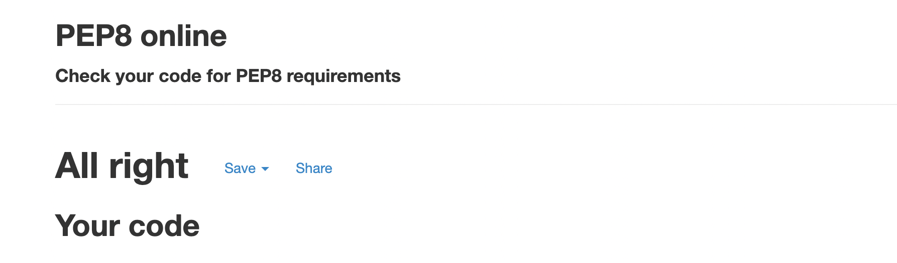

# A Student's cookbook

# About

  [Live Website](https://student-cookbook-m3.herokuapp.com/)

Student Cookbook is a collaborative cookbook for students by students. It's use is, however, not restricted to just students. The website can be used or viewed by anyone interested in a cheap meal. The main focus group for the project is students whereas this is one group that for some time in a lot of cases are affected by a restricted economy. It will serve as a source of inspiration when it comes to cheap and preferably easy cooking, something some students even barely do.

  

### User Stories

* Students

* Anyone with a restricted economy

* People interested in cooking aka "foodies"

* A user who wishes to be able to filter their recipy search based on different diet categories.

* A user who wishes to able to filter their recipy search based on estimated ingredient cost.

  

As previously elaborated in the "About" section the conecpt of this website is to cater to the estimated needs of a student with restricted economy and scheduale. In this day and age young a lot of young people also have restricted diets, whereas many are vegeterian or vegan or might have chosen to exclude for example gluten.

  

### Reasons for the website

* A website for browsing recipes with few or cheap ingredients

* A website where the user has the possibility to register, log in and thereby being able to add their own recipes

* Inspirational, for the user that has a lack of inspiration and wants to seek cooking inspiration

  

# Scope

  

### What the user may expect

* For the concept of the website to be clear and easily understood

* For the website to be intutitive and easy to use aka functional design.

* To be able to view recipes

* As the concept of the website is to be a collaborative cookbook, the user might expect to be able to add recipes.

  

### What the user may want

* To be able to add and edit their own recipes.

* To be able to register to make sure that recipes added by them could not easily be edited or deleted by other users.

* A search bar which makes it possible to filter recipes by ingredients, recipy name, category etc.

  

# Structure

## Wireframes

These are my initial wireframes. Some pages that I didn't know from the beginning would be in the project doesn't appear here. In the index.html page I decided to switch layout as the one pictured in the wireframes didn't look as good as intended when tested. "Recipie" was replaced by the corrected "Recipe". The Register page and Login use the same layout, these didn't change from the initial wireframes. 

#### Website navigation (front-end)
#### User who is not logged in
The user gets access to three main pages in the navbar:
* Register: If the user chose to Register he or she is then redirected to the "logged in" view of the website.
* Log In:  If the user already has an account he or she can chose to log in to then get access to the features of the page that acquires them to be "in session" (logged in). 
* View Recipes: To view recipes the user does not need to be logged in, they have the opportunity to view recipes in the database as well as viewing separate recipes from the recipes page.

#### User who is logged in
The user gets access to five main pages and or functionalities in the navbar:
* Log Out: This is not a page but an route that expires the user from It's user session, aka, the user get's logged out.
* Profile: The users profile page where he or she also get's access to adding a recipe or category.
* Add Recipe: Add Recipe Page for the user to add recipes to the database. From this page there is also possible to redirect to the "add category" page if needed.
* Categories: Categories page for browsing categories. From this page the user get's access to the "add category" page. The logged in user does not get the opportunity to edit or delete categories as this requires admin access. 
* View Recipes: The user get's access to view and search the database for recipes, if they are created by the same logged in user they have the opportunity to either delete or edit their recipe.

Overall the website consists of 15 pages. 

#### Database, Back-End
For this project I have used [MongoDB](https://cloud.mongodb.com/) which is a non-relational database in the cloud. It is free of use and works well with this type of project where the data-structure and fields may vary. To get easier access to the database I have used the Flask-PyMongo "bridge" (as can be found in the requirements.txt file). 

#### Create, Read, Update and Delete (CRUD)

My database is called "student_cookbook", It contains five collections:
* categories: Contains the _id: 
 (ObjectId(id_here)) and category_name: 
 ("category_name_here").
 "category_name" also matches the same object in the recipes collection
   * The logged in has access to create and read.
   * The Admin user has access to create, read, update and delete.
 

* cooking_time: Collection of cooking times for the user to choose by, created and managed from within the database. Users get to choose a "cooking_time" object and does not have the opportunity to add separate ones, as this would in time create an endless list of possible choices in the add or edit recipe pages of the website.
* pricing: Collection of timespans for the user to choose by, created and managed from within the database. Users get to choose a "pricing" object and does not have the opportunity to add separate ones, as this would in time create an endless list of possible choices in the add or edit recipe pages of the website.
* recipes: Collection of all the recipe objects currently in the database. Contains the value pairs: 
    * _id: ObjectId(""),
    * recipe_name: "",
    * recipe_category: "",
    * pricing: "",
    * cooking_time: "",
    * preparation: "",
    * image_src: "",
    * created_by: "",
    
* users: Collection of users registered on the database. Allows users to edit and delete recipes added by them. Also viewable in website as "Added by" paragraph in recipes.html and single_recipe.html.

## Design
The design is quite simple and mostly based on Materialize classes for responsiveness and layout. I've used the Materialize "card" class component which renders data in a way that is easy to maintain and structures the components in a efficient way. 

### Colors
I've used mainly the [Materialize Color Classes](https://materializecss.com/color.html) as these were simple to use and speeded up the development of the website. The colors used are ones that I 
find associate to food and cooking, mainly green as this is a color more broadly
associated with "healthy food". The colors for the buttons are green for adding and deleting and yellow for previous page. 

### Fonts
I've used the font-families "Roboto" and "Anton". Roboto for all text in the body except the logo, Anton for the logo. The fonts are applied through [Google Fonts](https://fonts.google.com/) stylesheet.

  

# Features
### Existing Features
#### Not Logged in:
* The user can Log In
* The User can Register their user account
* The user can view and search for recipes in the database
#### Logged in:
* The user can view recipes 
* The user can view categories 
* The user can search for recipes within the database
* The user can log out
* The user can add recipes, including recipe images to the database
* The user can edit and delete recipes if they are created by them
* The user can add a category

#### Admin
* Admin can delete and edit categories. 
 

### Features left to include

* For the user to be able to star a recipe and thereby get access to these on their profile page.

* For the user to be able to edit and/or delete their own recipes from their profile page.

~~* 404 Not Found, 500 internal error, 403 forbidden.~~ - Added

~~* For the user to be able to add a recipe image (using a link as a image source)~~  - Added

* ~~Search recipes functionality~~-  Added

## Technologies Used  
* HTML5
* CSS3
* JavaScript
   * jQuery (using functions provided by both Materialize and Code Institute.
* MongoDB (database)
* Python
   * Flask  
   * Flask Py-Mongo (for easier access to database)
   * Werkzeug
   * Jinja
 * Materialize CSS 
 * Heroku (hosting)
 * GitHub (documents and version control)
 * GitPod (IDE)
 * Google Fonts (fonts)
 * FontAwsome (icons)
 
## Testing

#### Bugs that occurred during development 

* Bug 1: When adding a new recipe to the database this appears in the middle of the row below the other recipes, this doesn't affect functionality, however It looks odd and misplaced.

Update Bug 1: Fixed by changing Materialize classes. 

* Bug 2: When adding a new recipe to the database, the chosen pricing and cooking time also gets added to the database, so the same value reappears in the dropdown menu. This, I think, will have to be resolved by manually adding these as separate objects to the database instead of, as it is for the moment, only appearing in database as separate keys in different objects.

Update Bug 2: After making the changes described above, changing "pricing" and "cooking_time" to be separate objects instead of keys, the choices does no longer add one choice every time a recipe is added. However when browsing the "estimated pricing" dropdown menu the prices are not in the correct order. It probably needs to be sorted in a different way.

### Automated Testing
#### Code Validation
#### [W3Validator](https://validator.w3.org/)
I validated my HTML by linking each separate page from the deployed website to the W3Validator. 
#### Home Page
First Testing: 
* Raised several errors, mostly about miswritten comments. 
Final testing: 

Comments about remaining warnings : I chose not to replace headings as the website renders as wanted.

* View Recipes Page
Same Warnings, no errors.
  * Log In Page
First Testing: 
  * Raised several errors, mostly about miswritten comments. But also about misplaced <i> elements, I removed the <i> elements. 
Final Testing:
Same errors as pictured above

Comments about remaining warnings : I chose not to replace headings as the website renders as wanted. 
* Register Page
Same warnings about headings
* Add Recipe Page
Same warnings as pictured above
* Edit Recipe Page
Raised same warning about h elements. 
* Add Category Page
Same warnings as pictured above
* Edit Category Page
Same warnings, no errors
* Single Recipe Page
First Testing: Raised several errors about i elements and forbidden use of linebreaks.
Final testing: Same warnings as pictured above.

#### [CSS Validator](https://jigsaw.w3.org/css-validator/validator)

No errors found.

#### AmIResponsive 

#### [Pep8](http://pep8online.com/checkresult#)
Python Pep8 requirements validator.
First testing: Had to remove whitespace, add new line, add whitespace.
Final:

####  Google Lighthouse

The website was tested in in [Lighthouse](https://developers.google.com/web/tools/lighthouse) using Google Developer Tools. By doing this Lighthouse creates scores for performance, accessibility, best practices, and SEO. Scored well in SEO and Accessibility, and fairly well in Performance and Best Practices. 

#### JsHint
Tested jQuery in JsHint. No Errors two warnings.

### Manual Testing
| Test Description| Expected Outcome | Result   |
| :---        |    :----:   |          ---: |
| Navbar      | When links in navbar are clicked they should lead to correct page      | Leads to correct page  |
Add Recipe |    The user should be able to add a recipe to the database| The user is able to add a recipe to the database
| Delete Recipe     |  The user should be able to delete a recipe they have created       | The user is able to delete recipes they "own" |
| Add Category   | The user should be able to add a category to the database       | User is able to add categories    |
| Edit Category     | Admin has access to editing category     | Does work  |
| Delete Category  | Admin should be able to delete a  category     | Does work      |
| Search Recipes      | The user should be able to search recipes in the database       | Works well. |
| Edit recipe  | The user should be able to edit a recipe they have created    | Does work
| Register  |  A new user should be able to register an account    | A new user is able to register an account.
| Log In  |  An existing user should be able to Log In to the website    | The existing user is able to Log in.
| Log Out  |  The logged in user should be able to log in to their account    | Works well.

### Testing User Stories
### What the user may expect
|Description| Result |
|--|--|
| For the concept of the website to be clear and easily understood | The landing page has a description of the website and the images and colors are appropiate to the theme | 
|  For the website to be intutitive and easy to use aka functional design. | Navigating through the website is easy, however, how to add a category might not be very clear. On the other hand this page is linked both through the "add recipe" page and in the categories page. 
|  To be able to view recipes | The user is able to view recipes in the recipes.html page.  
|   As the concept of the website is to be a collaborative cookbook, the user might expect to be able to add recipes. | The user is able to add recipes using the add_recipe.html page. | 

### What the user may want
|Description| Result |
|--|--|
|  To be able to add and edit their own recipes. | The logged in user is able to add and then edit their own recipes, they are also able to delete recipes. |
|  To be able to register to make sure that recipes added by them could not easily be edited or deleted by other users. | The user is able to register an account and thereby be granted permission to add, edit and delete their own recipes.
|   A search bar which makes it possible to filter recipes by ingredients, recipy name, category etc. | Search bar is visible and working in the recipes.html page.  

## Credits

* "Flask Mini-Project" which is one module from Code Institutes course was of big use when creating my project. This was of big help regarding how to structure the work, learning Materialize and naming conventions. Quite a lot of my websites design is partly based on this module.

* Code snippet from "Flask Mini Project" that is located in static/js/script.js file. This code snippet allows the Materialize dropdown menu to actually be "reqired" as it otherwise defaults to not required.

* Mentor Brian Macharia!

* Code Institue Tutors for great support

  

#### Images

These are the images uploaded manually by me to the website, however images uploaded or, more accurately, linked to by other users will not be able to be credited.

  

[Header Image](https://unsplash.com/photos/wMzx2nBdeng) - By Brooke Lark, Unsplash. 

